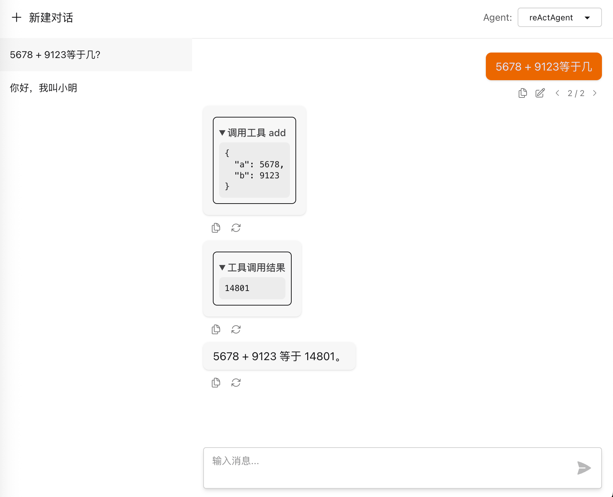

中文 | [English](README_EN.md)

一个基于Spring AI的ReAct agent库。

# 特性
## 一个封装好的ReActAgent
 - 基于Spring AI的ChatClient，可以使用ChatClient的所有特性
 - 支持限制每次调用的最大迭代次数
## 一个增强的ChatMemory
 - 支持消息分支
 - 保存了历史的Tool Call
 - 支持MySQL持久化和内存临时保存
 - 支持通过实现接口自定义消息的序列化
## 一个web调试页面
 - 一个提供了消息分支功能的测试页面

# 快速开始
本项目暂时还未发到Maven中央仓库，所以需要先将本仓库clone，然后使用命令 mvn clean install -DskipTests 安装到本地。 
## 一个简单的计算器Agent
添加maven依赖。
```xml 
<dependencyManagement>
    <dependencies>
        <!-- 引入BOM，统一版本 -->
        <dependency>
            <groupId>com.x3bits.springaireactagent</groupId>
            <artifactId>spring-ai-react-agent-bom</artifactId>
            <version>0.0.1-SNAPSHOT</version>
            <type>pom</type>
            <scope>import</scope>
        </dependency>
    </dependencies>
</dependencyManagement>

<dependencies>
    <!-- 基本功能只需要引入core -->
    <dependency>
        <groupId>com.x3bits.springaireactagent</groupId>
        <artifactId>spring-ai-react-agent-core</artifactId>
    </dependency>
</dependencies>

```
创建并调用Agent
```java
package com.x3bits.springaireactagent.core;

import com.x3bits.springaireactagent.core.event.ReActAgentEvent;
import com.x3bits.springaireactagent.core.memory.BranchMessageSaver;
import com.x3bits.springaireactagent.core.memory.MemoryBranchMessageSaver;
import org.springframework.ai.chat.client.ChatClient;
import org.springframework.ai.chat.model.ChatModel;
import org.springframework.ai.openai.OpenAiChatModel;
import org.springframework.ai.openai.OpenAiChatOptions;
import org.springframework.ai.openai.api.OpenAiApi;
import org.springframework.ai.tool.annotation.Tool;
import org.springframework.ai.tool.annotation.ToolParam;
import reactor.core.publisher.Flux;

public class ReActAgentExample {

    // 定义Tool
    private static class Calculator {
        @Tool(description = "计算两数之和")
        public int add(@ToolParam(description = "第1个加数") int a, @ToolParam(description = "第2个加数") int b) {
            return a + b;
        }
    }

    // 创建ReactAgent
    private static ReActAgent createReActAgent() {
        //Spring AI的ChatModel
        ChatModel chatModel = OpenAiChatModel.builder()
                .openAiApi(
                        OpenAiApi.builder()
                                .apiKey(System.getenv("OPENAI_API_KEY"))
                                .baseUrl("https://dashscope.aliyuncs.com/compatible-mode")
                                .build())
                .defaultOptions(
                        OpenAiChatOptions.builder()
                                .model("qwen-plus")
                                .build())
                .build();
        //Spring AI的ChatClient
        ChatClient chatClient = ChatClient.builder(chatModel)
                .defaultTools(new Calculator())
                .build();
        //这里使用MemoryBranchMessageSaver，用于测试时临时保存对话历史。生产环境需要使用支持持久化的Saver，例如JdbcTemplateBranchMessageSaver
        BranchMessageSaver messageSaver = new MemoryBranchMessageSaver();
        return ReActAgent.builder(chatClient)
                .messageSaver(messageSaver)
                .systemPrompt("你是一个整数加法计算器，你使用工具add计算两数之和。")
                .build();
    }

    public static void main(String[] args) {
        ReActAgent reActAgent = createReActAgent();
        RunAgentOptions options = RunAgentOptions.builder()
                .newUserMessage("123 + 456等于多少？")
                .threadId("test-thread")
                .enableStream(true)
                .build();
        Flux<ReActAgentEvent> eventFlux = reActAgent.run(options);
        eventFlux.doOnNext(System.out::println).blockLast();
    }
}
```

完整的代码请参考 [SimpleReActAgentDemo](spring-ai-react-agent-example/src/test/java/com/x3bits/springaireactagent/example/demos/SimpleReActAgentDemo.java)

# 其它例子
在 [demos](spring-ai-react-agent-example/src/test/java/com/x3bits/springaireactagent/example/demos) 测试目录下有主要功能用法的示例
 - 使用MySQL对消息做持久化 [MySqlPersistenceDemo.java](spring-ai-react-agent-example/src/test/java/com/x3bits/springaireactagent/example/demos/MySqlPersistenceDemo.java)
 - 消息回溯和分支 [MessageBranchDemo.java](spring-ai-react-agent-example/src/test/java/com/x3bits/springaireactagent/example/demos/MessageBranchDemo.java)
 - Tool上下文，以及如何从Tool中向外部传递消息 [ToolContextDemo.java](spring-ai-react-agent-example/src/test/java/com/x3bits/springaireactagent/example/demos/ToolContextDemo.java)

# 使用调试页面
本项目提供了一个用于调式的页面，界面如下图：


## 通过starter引入调试页面
添加starter依赖，starter会自动配置web调试页面：
```xml
<!--引入bom部分省略，见快速开始部分-->

<dependencies>
    <!-- 引入starter，自动配置web调试页面 -->
    <dependency>
        <groupId>com.x3bits.springaireactagent</groupId>
        <artifactId>spring-ai-react-agent-starter</artifactId>
    </dependency>
</dependencies>
```

在application.yml中配置：
```yaml
spring:
  # 如果需要调试页面使用mysql保存对话列表持久化，需要做这个数据库配置，如果使用内存则不需要
  datasource:
    url: jdbc:mysql://localhost:3306/spring_ai_react_agent?useSSL=false&serverTimezone=UTC&allowPublicKeyRetrieval=true
    username: root
    password:
    driver-class-name: com.mysql.cj.jdbc.Driver

  ai:
    react-agent:
      enabled: true  # 启用调试页面，请仅在测试环境中使用true
      storage-type: mysql  # 如何存储调试页面的对话列表，可选值：mysql, memory
```
如果要把对话列表保存到MySQL，需要在MySQL库中按照 [schema.sql](spring-ai-react-agent-web/scripts/schema.sql) 创建表。

将ReActAgent配置成Spring的Bean，可以配置多个，通过调试页面的右上角选择
```java
@Configuration
public class ReActAgentConfig {

    @Bean
    public ReActAgent reActAgent() {
        // 代码省略...
    }
}
```

启动应用后，访问 `http://localhost:8080/springAiReactAgent/` 即可使用调试页面。

完整的示例代码请参考 [spring-ai-react-agent-example](spring-ai-react-agent-example) 。

# 运行示例工程
 - clone本仓库
 - 配置环境变量OPEN_AI_APIKEY为你的模型的apikey。 示例项目使用的是阿里云的qwen-plus模型，如果使用其它的模型，请修改application.yml中的配置base-url和model。
 - 创建一个MySQL的库，在里面创建如下两张表：
[schema.sql](spring-ai-react-agent-web/scripts/schema.sql)
[mysql-schema.sql](spring-ai-react-agent-saver/spring-ai-react-agent-saver-jdbc-template/scripts/mysql-schema.sql)
 - 安装本项目到本地maven，打包并运行示例工程
```bash
mvn clean install
cd spring-ai-react-agent-example
mvn clean package
java -jar target/spring-ai-react-agent-example-0.0.1-SNAPSHOT.jar 
```