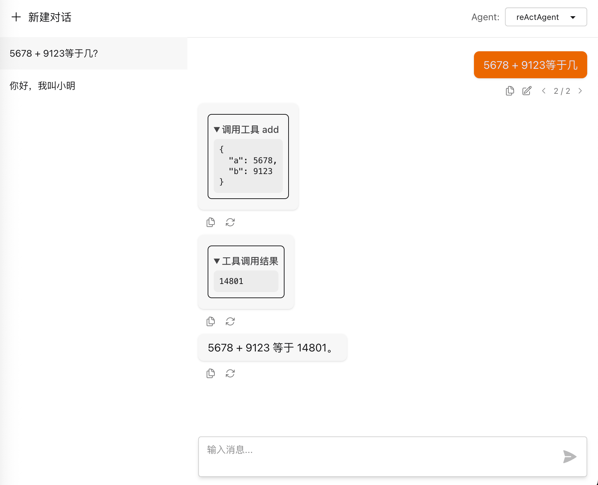

[中文](README.md) | English

A ReAct agent library based on Spring AI.

# Features
## A Wrapped ReActAgent
 - Based on Spring AI's ChatClient, which means that you can use all features of ChatClient.
 - Supports limiting the maximum number of iterations per call.
## An Enhanced ChatMemory
 - Supports message branching.
 - Saves tool calling messages.
 - Supports MySQL persistence and in-memory temporary storage.
 - Supports custom message serialization by implementing interfaces.
## A Web Debug Page
 - A test page that provides message branching functionality.

# Quick Start
This project has not yet been published to the Maven Central Repository, so you need to clone this repository first and then use the command `mvn clean install -DskipTests` to install it locally.
## A Simple Calculator Agent
Add Maven dependency.
```xml 
<dependencyManagement>
    <dependencies>
        <!-- Import BOM for unified version management -->
        <dependency>
            <groupId>com.x3bits.springaireactagent</groupId>
            <artifactId>spring-ai-react-agent-bom</artifactId>
            <version>0.0.1-SNAPSHOT</version>
            <type>pom</type>
            <scope>import</scope>
        </dependency>
    </dependencies>
</dependencyManagement>

<dependencies>
    <!-- Only need to import core for basic functionality -->
    <dependency>
        <groupId>com.x3bits.springaireactagent</groupId>
        <artifactId>spring-ai-react-agent-core</artifactId>
    </dependency>
</dependencies>

```
Create and invoke Agent
```java
package com.x3bits.springaireactagent.core;

import com.x3bits.springaireactagent.core.event.ReActAgentEvent;
import com.x3bits.springaireactagent.core.memory.BranchMessageSaver;
import com.x3bits.springaireactagent.core.memory.MemoryBranchMessageSaver;
import org.springframework.ai.chat.client.ChatClient;
import org.springframework.ai.chat.model.ChatModel;
import org.springframework.ai.openai.OpenAiChatModel;
import org.springframework.ai.openai.OpenAiChatOptions;
import org.springframework.ai.openai.api.OpenAiApi;
import org.springframework.ai.tool.annotation.Tool;
import org.springframework.ai.tool.annotation.ToolParam;
import reactor.core.publisher.Flux;

public class ReActAgentExample {

    // Define Tool
    private static class Calculator {
        @Tool(description = "Calculate the sum of two numbers")
        public int add(@ToolParam(description = "First addend") int a, @ToolParam(description = "Second addend") int b) {
            return a + b;
        }
    }

    // Create ReactAgent
    private static ReActAgent createReActAgent() {
        //Spring AI's ChatModel
        ChatModel chatModel = OpenAiChatModel.builder()
                .openAiApi(
                        OpenAiApi.builder()
                                .apiKey(System.getenv("OPENAI_API_KEY"))
                                .baseUrl("https://dashscope.aliyuncs.com/compatible-mode")
                                .build())
                .defaultOptions(
                        OpenAiChatOptions.builder()
                                .model("qwen-plus")
                                .build())
                .build();
        //Spring AI's ChatClient
        ChatClient chatClient = ChatClient.builder(chatModel)
                .defaultTools(new Calculator())
                .build();
        //Using MemoryBranchMessageSaver here for temporary storage during testing. Production environment needs to use persistent Saver, such as JdbcTemplateBranchMessageSaver
        BranchMessageSaver messageSaver = new MemoryBranchMessageSaver();
        return ReActAgent.builder(chatClient)
                .messageSaver(messageSaver)
                .systemPrompt("You are an integer addition calculator, you use the add tool to calculate the sum of two numbers.")
                .build();
    }

    public static void main(String[] args) {
        ReActAgent reActAgent = createReActAgent();
        RunAgentOptions options = RunAgentOptions.builder()
                .newUserMessage("What is 123 + 456?")
                .threadId("test-thread")
                .enableStream(true)
                .build();
        Flux<ReActAgentEvent> eventFlux = reActAgent.run(options);
        eventFlux.doOnNext(System.out::println).blockLast();
    }
}
```

For complete code, please refer to [SimpleReActAgentDemo](spring-ai-react-agent-example/src/test/java/com/x3bits/springaireactagent/example/demos/SimpleReActAgentDemo.java)

# Other Examples
In the [demos](spring-ai-react-agent-example/src/test/java/com/x3bits/springaireactagent/example/demos) test directory, there are examples of main functionality usage
 - Using MySQL for message persistence [MySqlPersistenceDemo.java](spring-ai-react-agent-example/src/test/java/com/x3bits/springaireactagent/example/demos/MySqlPersistenceDemo.java)
 - Message rollback and branching [MessageBranchDemo.java](spring-ai-react-agent-example/src/test/java/com/x3bits/springaireactagent/example/demos/MessageBranchDemo.java)
 - Tool context and how to pass messages from Tool to external [ToolContextDemo.java](spring-ai-react-agent-example/src/test/java/com/x3bits/springaireactagent/example/demos/ToolContextDemo.java)

# Using the Debug Page
This project provides a debug page with the interface shown below:


## Introducing Debug Page via Starter
Add starter dependency, the starter will automatically configure the web debug page:
```xml
<!--BOM import section omitted, see Quick Start section-->

<dependencies>
    <!-- Import starter to automatically configure web debug page -->
    <dependency>
        <groupId>com.x3bits.springaireactagent</groupId>
        <artifactId>spring-ai-react-agent-starter</artifactId>
    </dependency>
</dependencies>
```

Configure in application.yml:
```yaml
spring:
  # If you need the debug page to use mysql for conversation list persistence, you need this database configuration. If using memory, this is not needed
  datasource:
    url: jdbc:mysql://localhost:3306/spring_ai_react_agent?useSSL=false&serverTimezone=UTC&allowPublicKeyRetrieval=true
    username: root
    password:
    driver-class-name: com.mysql.cj.jdbc.Driver

  ai:
    react-agent:
      enabled: true  # Enable debug page, please only use true in test environment
      storage-type: mysql  # How to store conversation list for debug page, options: mysql, memory
```
If you want to save the conversation list to MySQL, you need to create tables in the MySQL database according to [schema.sql](spring-ai-react-agent-web/scripts/schema.sql).

Configure ReActAgent as a Spring Bean, you can configure multiple ones and select them through the top-right corner of the debug page
```java
@Configuration
public class ReActAgentConfig {

    @Bean
    public ReActAgent reActAgent() {
        // Code omitted...
    }
}
```

After starting the application, visit `http://localhost:8080/springAiReactAgent/` to use the debug page.

For complete example code, please refer to [spring-ai-react-agent-example](spring-ai-react-agent-example).

# Running the Example Project
Clone this repository
```bash
mvn clean install
cd spring-ai-react-agent-example
mvn clean package
java -jar target/spring-ai-react-agent-example-0.0.1-SNAPSHOT.jar 
```
